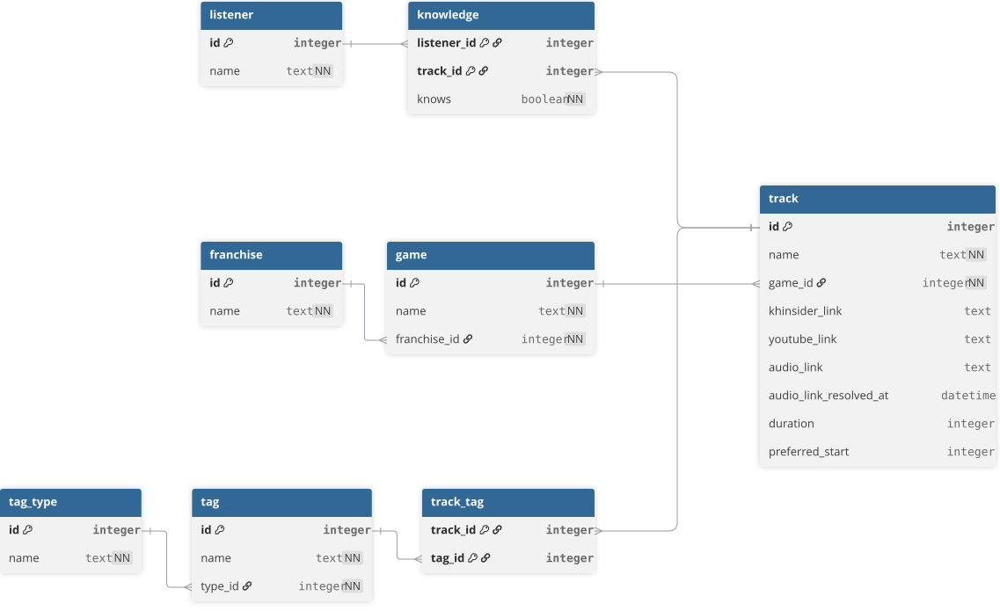

# Music Blindtest

Application pour gérer une base de données de musiques de jeux vidéo et organiser des blindtests.

C'est un projet personnel que je voulais faire depuis longtemps et que je commence enfin sérieusement. Il servira aussi à l'association **InsaLan**, qui pourra l'utiliser pour ses animations.

> Le projet en est encore à ses débuts, la majorité de la roadmap est encore à faire

## Pourquoi ce projet ?

Aujourd'hui, la base de musiques d'InsaLan vit dans un Google Sheet. Ça marche, mais ça devient limité :

- pas de vraies relations entre les jeux, les franchises et les musiques ;
- pas de tags pour filtrer (genre, ambiance, difficulté...) ;
- pas de suivi de qui connaît quelle musique ;
- les liens audio directs disparaissent régulièrement.
- la création de playlists est très compliquée

L'idée est de garder le Google Sheet comme point de départ et de construire une vraie application par-dessus qui finira par s'en détacher.

## Objectifs

- **Une webapp** pour gérer la base et lancer des blindtests.
- **Une version installable** sur Windows et Linux, pour pouvoir héberger l'application en local. Cet aspect-là n'est pas vraiment primordial et est surtout là dans un but d'apprentissage.
- **Importer les données du Google Sheet** (la version modèle à jour du 21/09/26 est disponible dans [`docs/`](docs/ost-insalan-base.csv), la correspondance des colonnes est décrite dans [`docs/import-gsheet.md`](docs/import-gsheet.md)).
- Apprendre différentes techniques au passage (base de données, architecture, packaging, etc.).

## D'où viennent les musiques ?

Les musiques viennent de [KHInsider](https://downloads.khinsider.com/) quand elles sont disponibles. Le problème, c'est que les liens audio directs expirent assez souvent. 

Le projet stocke donc le lien de la page KHInsider de chaque musique et retrouve le lien audio à la demande. Le dernier lien trouvé est gardé en cache dans la base (`audio_link`, avec sa date `audio_link_resolved_at`). 

> Si une musique n'est pas sur KHInsider, on utilise un lien YouTube à la place.

Les liens audio du Google Sheet ne sont pas repris à l'import, car aucun n'est fiable : seuls les liens YouTube le sont. `audio_link` n'est rempli qu'à partir des pages KHInsider.

Pour l'instant, les fichiers audio ne sont pas téléchargés ni stockés. Ça pourrait venir plus tard, mais ce n'est pas la priorité.

## Base de données

Le schéma est décrit dans [`docs/database/schema.dbml`](docs/database/schema.dbml) (source éditable, à ouvrir avec [dbdiagram.io](https://dbdiagram.io)).

Par rapport au Google Sheet d'origine, les changements principaux sont :

- renommage de différents champs
- les **tags**, organisés par type (genre, ambiance, etc.) ;
- des champs de durée et de début d'audio

## Roadmap

### Création d'une appli de blindtests
- Conception du projet
- Création de la DB
- Import du GSheet dans la DB
- Mise en place du cache des liens audios
- Mise en place de la lecture des audios
- Création des blindtests

### Enrichissement de l'appli
- Implémentation de la difficulté
- Implémentation du système de vote
- Création d'un système d'ajout de musiques
- Création d'un système de suggestion de jeux sans musique : proposer un jeu sans encore avoir de bande originale, et lister tous les jeux de la base avec leur nombre de musiques pour savoir où chercher de nouvelles musiques

### Pour aller plus loin
- Implémentation du système de tags
- Création d'un système de suggestions de tags
- Création d'un système d'utilisateurs
- Création d'un système d'uniformisation et de complétion des données par les utilisateurs
- Création de playlists personnalisées et personnalisables (ajout des tables `playlist` et `user_preferred_tags` dans la DB)
- Ajout des noms valides (réponses acceptées) de chaque musique, colonne « Noms Valides » du Google Sheet non importée pour l'instant

## Stack technique

- **Backend** : Spring Boot 4 (Java 21), API REST, dans [`backend/`](backend/).
- **Base de données** : SQLite, accès via Spring Data JPA (Hibernate), schéma géré par Flyway.
- **Frontend** : React 19 et TypeScript, construit avec Vite, dans [`frontend/`](frontend/).

## Lancer le projet

Prérequis : Java 21 et Node 22

- **Backend**: `cd backend && ./mvnw spring-boot:run` (http://localhost:4673).
- **Frontend**: `cd frontend && npm install && npm run dev` (http://localhost:4672).
- **Importer le Google Sheet**: `cd backend && ./mvnw spring-boot:run -Dspring-boot.run.arguments=--import=../docs/ost-insalan-base.csv`.
  Le format du fichier est décrit dans [`docs/import-gsheet.md`](docs/import-gsheet.md).

## Contexte

Projet réalisé dans le cadre de l'association InsaLan afin d'apporter de nouvelles activités à l'association tout en progressant individuellement.